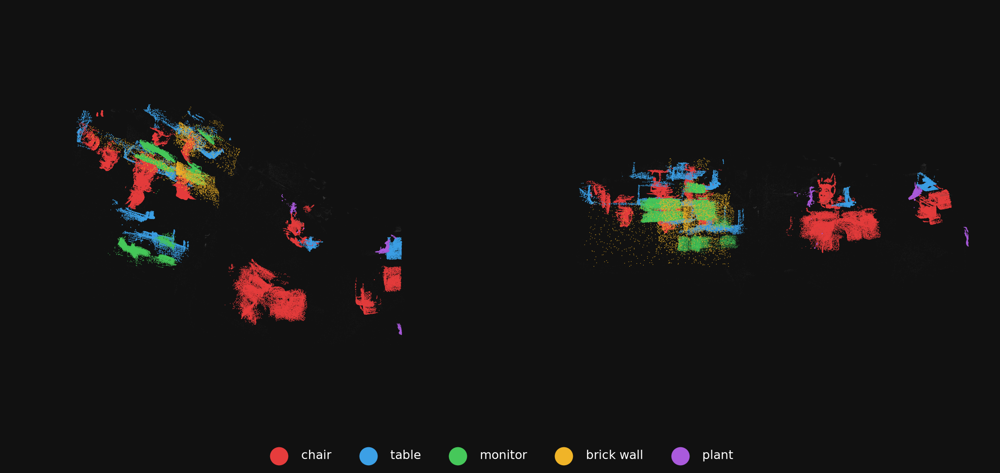
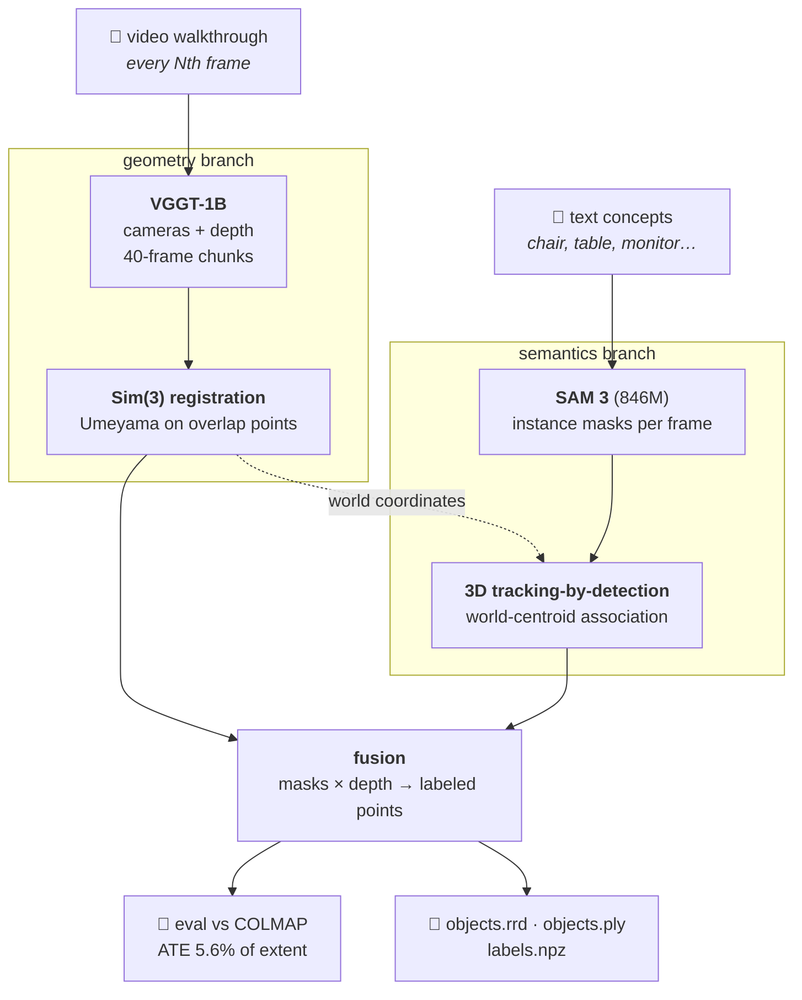
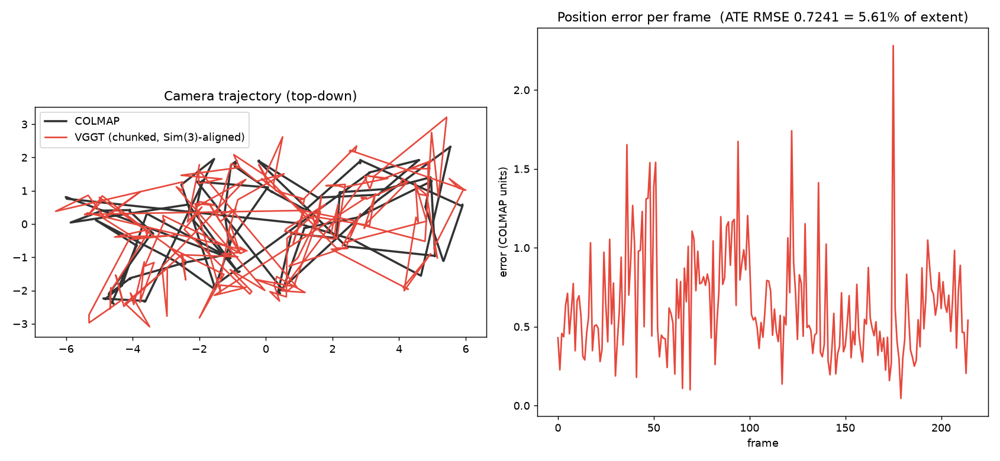
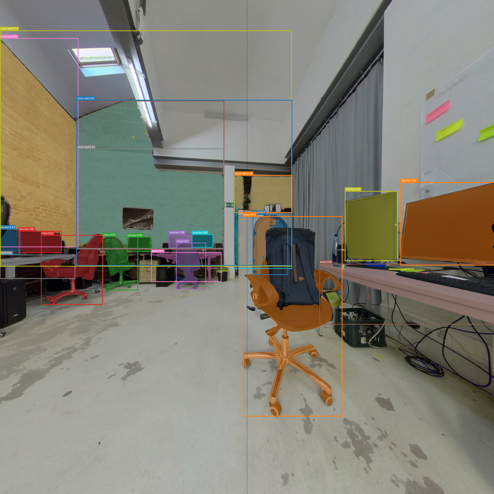

<div align="center">

# OpenVocab-4D

**Video + text → labeled 3D scene. Fully local, on an 8 GB GPU.**

[](https://www.python.org/)
[](https://pytorch.org/)
[](https://github.com/facebookresearch/vggt)
[](https://github.com/facebookresearch/sam3)
[](LICENSE)



*A 488-frame phone-style walkthrough → 49 persistent 3D objects.*
*<span style="color:#e6483c">chair</span> · <span style="color:#3ca0e6">table</span> · <span style="color:#46c85a">monitor</span> · <span style="color:#f0b428">brick wall</span> · <span style="color:#aa5adc">plant</span>*

</div>

---

## What it does

Type `"chair, table, monitor"`, point it at a video walkthrough, and get back:

- 🗺️ **Metric 3D reconstruction** — cameras, depth, dense point cloud (no COLMAP needed)
- 🏷️ **Every instance of every concept** segmented, tracked, and placed in world space
- 🖱️ **Interactive 3D scene** — orbit it, toggle object groups on/off (Rerun viewer)
- 📊 **Benchmark report** — pose accuracy vs. a COLMAP reference, if you have one

## How it works



**One sentence per stage:**

| Stage | What happens |
|---|---|
| **VGGT** (CVPR 2025 Best Paper) | one transformer forward pass → cameras + depth, no feature matching or bundle adjustment |
| **Sim(3) registration** | overlapping chunk frames give exact 3D↔3D correspondences → closed-form scale/rotation/translation per seam |
| **SAM 3** | *"promptable concept segmentation"* — every instance of an open-vocabulary phrase, per frame |
| **3D tracking** | detections matched by **world-space centroid** — viewpoint-invariant identity for free |
| **Fusion** | every tracked mask back-projected through depth + cameras → per-object point clouds |

Full technical deep-dive: **[docs/ARCHITECTURE.md](docs/ARCHITECTURE.md)**

## Install

> **Requirements:** NVIDIA GPU 8 GB+ (Windows/Linux) · Python 3.12+ · git
> macOS installs run CPU/MPS — experimental and slow.

<details open>
<summary><b>🪟 Windows</b></summary>

```powershell
git clone https://github.com/muhammadmahadazher/openvocab-4D
cd openvocab-4D
powershell -ExecutionPolicy Bypass -File install.ps1
```
</details>

<details>
<summary><b>🐧 Linux</b></summary>

```bash
git clone https://github.com/muhammadmahadazher/openvocab-4D
cd openvocab-4D
bash install.sh
```
</details>

<details>
<summary><b>🍎 macOS (experimental, CPU/MPS)</b></summary>

```bash
git clone https://github.com/muhammadmahadazher/openvocab-4D
cd openvocab-4D
bash install.sh
```
</details>

**One manual step (all platforms):** SAM 3 weights are license-gated by Meta —
accept once at [huggingface.co/facebook/sam3](https://huggingface.co/facebook/sam3), then:

```bash
hf auth login
```

## Run

| | Command |
|---|---|
| 🖥️ **GUI** | `ov4d-gui` → opens in your browser |
| ⌨️ **CLI** | `ov4d --images <frames> --out out/scene --prompts "chair,table" --render` |
| 🧊 **View a result** | `rerun out/scene/objects.rrd` |

### Test it in 5 minutes

1. `ov4d-gui` → browser opens
2. Drop in any **.mp4** (a slow 30–60 s walkthrough of a room works best) — or paste a folder path of frames
3. Concepts: `chair, table, monitor` → click **Reconstruct**
4. Watch the live log (VGGT chunks → tracking → fusion, ~5–10 min for a short video)
5. Click **Open 3D viewer** → orbit the scene, toggle `world/objects/<concept>` in the tree

Step-by-step guide with screenshots-level detail + troubleshooting: **[docs/USAGE.md](docs/USAGE.md)**

## Results

**Pose accuracy vs COLMAP** (loft walkthrough, 215 matched frames, RTX 4060 Laptop 8 GB):

| Metric | OpenVocab-4D | COLMAP (reference) |
|---|---|---|
| ATE RMSE | **5.6 % of extent** | — |
| Rotation error (median / p90) | **7.9° / 10.8°** | — |
| Runtime (geometry) | **~3.5 min** | hours |
| Bundle adjustment | none (feed-forward) | global |



**Open-vocabulary tracking — two modes, one flag:**

| Mode | Objects found | Longest track | Character |
|---|---|---|---|
| `--no-reid` (spatial only) | 49 | ~8 detections | compact counts, identity splits over time |
| default (DINOv2 re-ID + consolidation) | 119 | **214 / 244 frames** | identity survives room revisits, over-counts from double-detections |

<details>
<summary><b>SAM 3 per-frame segmentation example</b></summary>

</details>

**VRAM engineering** (why it fits in 8 GB):

| Component | Config | Peak VRAM |
|---|---|---|
| VGGT-1B, 40-frame chunks | bf16 + autocast | 6.35 GiB |
| SAM 3 image (846M) | bf16 autocast | 3.8–4.2 GiB |
| 3D tracking, 5 concepts × 244 frames | spatial / +re-ID | 4.1 GiB · 212 s / 4.2 GiB · 445 s |
| SAM 3/3.1 *video* tracker | any config | ❌ OOM — [why](docs/ARCHITECTURE.md#stage-2--open-vocabulary-instances-with-persistent-identity) |

## Limitations (honest)

- 🔁 Re-ID mode over-counts: SAM 3 sometimes double-detects (whole object + part), and the merge pass deliberately refuses to fuse tracks seen simultaneously — mask-IoU-aware merging is the next step (DINOv3 embeddings are a drop-in once its gated weights are granted)
- 📐 Chunk-chaining drift; a pose graph would tighten the 5.6 % ATE
- 🧍 Static-scene assumption — moving objects belong to D4RT-style dynamic reconstruction
- 🍎 macOS = CPU-mode, minutes become hours

## Project layout

```
reconstruct.py        CLI entry (ov4d)
app.py                Gradio GUI (ov4d-gui)
trackA/
  milestone1..4_*.py  pipeline stages (each runs standalone)
  eval_colmap.py      pose-accuracy benchmark (parses COLMAP .bin natively)
  render_scene.py     README-style renders
docs/
  ARCHITECTURE.md     how every stage works, with the math
  USAGE.md            step-by-step run/test guide + troubleshooting
install.ps1 / .sh     one-command setup (Win / Linux / macOS)
```

## References

- Wang et al., **VGGT: Visual Geometry Grounded Transformer** — CVPR 2025 *Best Paper* · [repo](https://github.com/facebookresearch/vggt)
- Carion, Gustafson, Hu et al., **SAM 3: Segment Anything with Concepts** — Meta, 2025 · [repo](https://github.com/facebookresearch/sam3)
- Zhang et al., **D4RT** — CVPR 2026 *Best Paper* (the dynamic-scene upgrade path)
- Dataset: DigAkust loft scan (Aspekteins GmbH) via Kaggle, with COLMAP reference
- Umeyama, TPAMI 1991 — closed-form Sim(3) estimation

<div align="center">
<sub>Built end-to-end on a single RTX 4060 Laptop (8 GB) · MIT License</sub>
</div>
